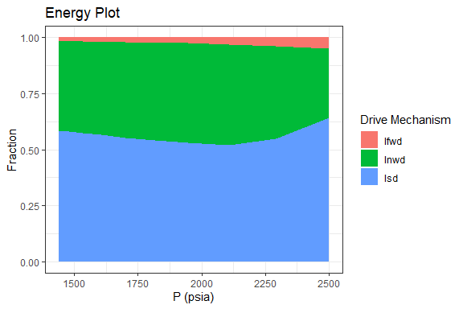

<!-- README.md is generated from README.Rmd. Please edit that file -->

# Rmbal

<!-- badges: start -->

<!-- badges: end -->

`Rmabl` is a material balance package for evaluation of original
hydrocarbon in-place, and reservoir performance and forecast. It applies
to black oil, volatile oil, gas condensate, wet gas, and dry gas
reservoirs and can handle the the performance of over-pressured gas
resources.

## Installation

You can install the released version of Rmbal from
[CRAN](https://CRAN.R-project.org) with:

``` r
install.packages("Rmbal")
```

## Example

### Production Drive Mechanisms


